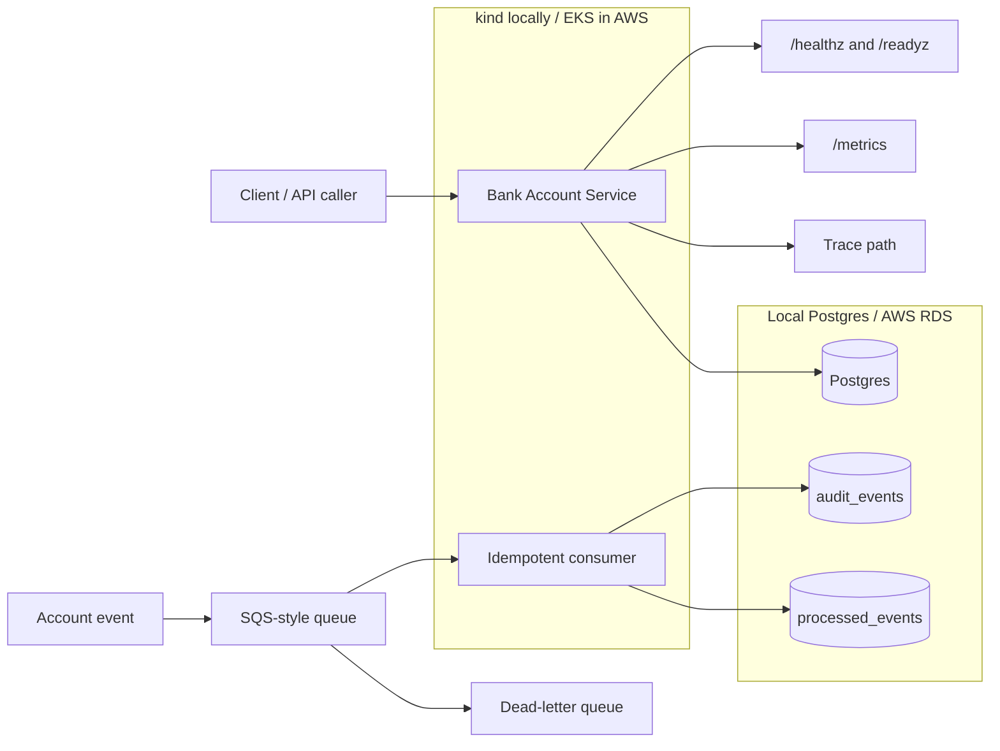

# Bank Account Service Platform

## Objective

This repository implements a deliberately simple account lookup service and the platform controls around it. The objective is to show how a small service would be packaged, deployed, secured, observed, and operated in a regulated-bank-style environment.

The application is intentionally small:

- `GET /healthz`
- `GET /readyz`
- `GET /metrics`
- `GET /api/accounts/{id}`

The focus is the platform around the service: container hardening, Kubernetes/Helm deployment, zero-downtime rollout behaviour, Postgres least-privilege access, idempotent messaging, CI/CD gates, Terraform AWS mapping, observability, and recovery thinking.

The local path targets kind and Docker Compose. The production path is expressed through AWS-oriented Terraform and Helm values. Terraform is authored and validated but not applied for this assessment.

## Architecture

The HTTP service handles account lookup requests. Readiness depends on both Postgres reachability and the pod not being in draining mode. The consumer handles asynchronous audit-style events and uses `processed_events` as a dedupe table so redelivery does not repeat the side effect. Metrics, tracing, dashboards, and alerts are included as observability evidence.

## Runtime model

| Target | Purpose | Status |
|---|---|---|
| kind | Local Kubernetes validation of the Helm workload | Local/optional |
| Docker Compose | Local dependencies such as Postgres and supporting services | Local/optional |
| AWS Terraform | Production-shaped mapping for EKS, ECR, RDS, IAM, SQS and secrets | Authored and validated only |
| GitHub Actions | CI/CD gates, deployment shape, rollback and Terraform controls | Authored |

The local path proves the workload shape without cloud spend. The AWS path shows the production architecture I would use, but is intentionally not applied.

## Reviewer navigation

| Reader goal | Start here |
|---|---|
| Understand the design trade-offs | `submission/DECISIONS.md` |
| Understand zero-downtime rollout | `docs/zero-downtime-rollout.md` |
| Understand how to run or validate locally | `docs/how-to-run.md` |
| Review Kubernetes workload | `k8s/helm/bank-account-service/` |
| Review container build | `app/Dockerfile` |
| Review database access model | `docs/database-access.md` and `local/postgres/002_runtime_role.sql` |
| Review messaging semantics | `docs/messaging-semantics.md` |
| Review CI/CD and rollback | `.github/workflows/` and `docs/rollback.md` |
| Review Terraform AWS mapping | `infra/terraform/` |
| Review observability | `observability/`, `local/prometheus/`, and `local/grafana/` |

## Deliverables map

| Requirement | Evidence | Notes |
|---|---|---|
| Container | `app/Dockerfile` | Multi-stage Dockerfile, non-root user, pinned Python base image version and `HEALTHCHECK`. Runtime restrictions such as read-only root filesystem and dropped Linux capabilities are shown in the Kubernetes security context. |
| Kubernetes workload | `k8s/helm/bank-account-service/` | Helm chart containing Deployment, Service, probes, PDB, HPA, NetworkPolicy, ServiceAccount and security contexts. |
| Zero-downtime rollout | `docs/zero-downtime-rollout.md`, `k8s/helm/bank-account-service/templates/deployment.yaml` | Documents readiness, draining, `preStop`, `terminationGracePeriodSeconds` and rolling update behaviour. |
| Postgres provisioning | `infra/terraform/modules/rds/`, `local/postgres/` | AWS production mapping uses RDS; local schema, seed data and grants are in SQL. |
| Least-privilege database role | `local/postgres/002_runtime_role.sql`, `docs/database-access.md` | Runtime role has required grants only and no owner, superuser or DDL privileges. |
| Credential handling | `k8s/helm/bank-account-service/templates/externalsecret.yaml`, `k8s/helm/bank-account-service/templates/secret.yaml`, `infra/terraform/modules/secrets/`, `infra/terraform/modules/irsa/`, `docs/database-access.md`, `docs/production-mapping.md` | Local secret path for kind and AWS mapping to Secrets Manager plus IRSA/EKS Pod Identity. |
| Connection pooling decision | `submission/DECISIONS.md`, `docs/database-access.md` | PgBouncer is not added locally; transaction pooling is considered for production if RDS connection pressure appears. |
| Backup and restore | `docs/backup-restore.md`, `submission/DECISIONS.md` | RPO/RTO and restore drill approach. |
| Messaging primitive | `docs/messaging-semantics.md`, `submission/DECISIONS.md` | SQS-style queue implementation and trade-off versus log-based streams. |
| Idempotent consumer | `app/src/bank_account_service/consumer.py`, `app/src/bank_account_service/idempotency.py`, `app/tests/test_consumer_idempotency.py` | `processed_events` dedupe makes duplicate delivery produce one side effect. |
| Poison messages / DLQ | `docs/messaging-semantics.md`, `infra/terraform/modules/sqs/` | Retry transient failures; park malformed messages in DLQ. |
| CI/CD | `.github/workflows/docker.yml`, `.github/workflows/kubernetes.yml`, `.github/workflows/terraform-plan.yml`, `.github/workflows/terraform-apply.yml` | Tests, image build, Trivy scan gate, immutable tag, OIDC, manual approval and deploy shape. |
| Rollback path | `docs/rollback.md` | Docker image rollback by previous SHA; Kubernetes rollback by Helm revision; Terraform rollback by revert/plan/apply and PITR for stateful data. |
| Terraform | `infra/terraform/`, `infra/terraform/plans/sanitized-plan.txt` | Modular AWS mapping. Authored and validated, not applied. |
| Observability | `observability/README.md`, `observability/alerts/bank-account-service-alerts.yaml`, `observability/dashboards/bank-account-service-dashboard.json`, `observability/data-scrubbing.md`, `observability/traces/trace-path.md`, `local/prometheus/`, `local/grafana/` | RED metrics, trace path, dashboard/panel, alert rule and data scrubbing notes. |
| Decisions document | `submission/DECISIONS.md` | Covers biggest decisions, SLO/alerting, least privilege/blast radius, recovery and what was cut. TODO: restore root `DECISIONS.md` if the submission must expose it at the repository root. |

## Part 1: Build

The build deliverables are implemented across the service, container, Helm chart, SQL, messaging consumer, CI/CD workflows, Terraform and observability files. The table above maps each assessment item to the relevant files.

The most important implementation paths are:

- `app/Dockerfile`
- `k8s/helm/bank-account-service/`
- `local/postgres/`
- `app/src/bank_account_service/consumer.py`
- `app/src/bank_account_service/idempotency.py`
- `infra/terraform/`
- `.github/workflows/`
- `observability/`

## Part 2: Decisions and trade-offs

The decisions document is:

- `submission/DECISIONS.md`

It covers:

- biggest design decisions
- SLO and burn-rate alerting
- least privilege and blast radius
- Postgres and messaging recovery
- what was intentionally cut for time

## Where to run or validate it

The detailed local run and validation steps are documented in:

- `docs/how-to-run.md`

That guide covers the kind/Docker Compose path, Helm rendering, test commands and Terraform validation.

The main validation intent is:

- app tests
- Docker build
- Helm lint/template
- Terraform fmt/validate
- optional kind deployment

## Local-to-AWS mapping

| Local / assessment path | AWS production mapping |
|---|---|
| kind Kubernetes cluster | EKS |
| Local Docker image loaded into kind | ECR image tagged by Git SHA |
| Helm chart | EKS workload deployed by Helm |
| Local Postgres / Docker Compose Postgres | RDS Postgres |
| Local Kubernetes Secret | AWS Secrets Manager + External Secrets |
| Kubernetes ServiceAccount | IRSA or EKS Pod Identity |
| LocalStack SQS or documented SQS-style queue | Amazon SQS + DLQ |
| Prometheus/Grafana/Otel local config | AMP/Grafana/Datadog/CloudWatch depending on platform standard |
| Terraform validation only | Production AWS resources after approval |

## Notes

This is an assessment implementation, not a live AWS deployment.

Intentionally not included or not fully applied:

- real AWS deployment
- production DNS/TLS
- full External Secrets controller installation
- production load testing
- full migration framework
- service mesh
- ArgoCD/GitOps
- Backstage
- advanced policy-as-code

The priority was to show the controls closest to reliable operation in a regulated environment: safe rollout, least privilege, idempotent messaging, recovery thinking, CI/CD gates and observability.
